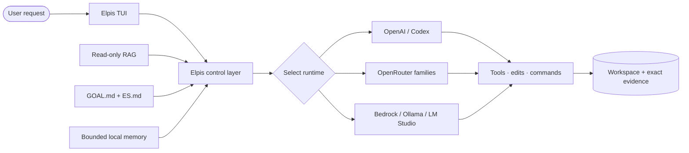
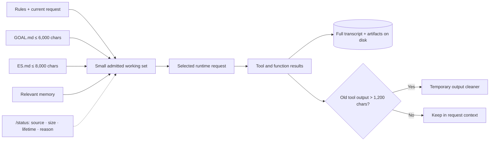
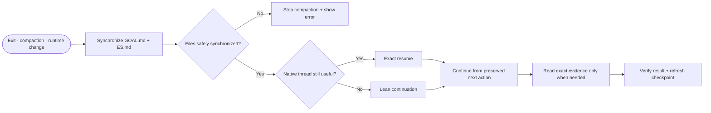
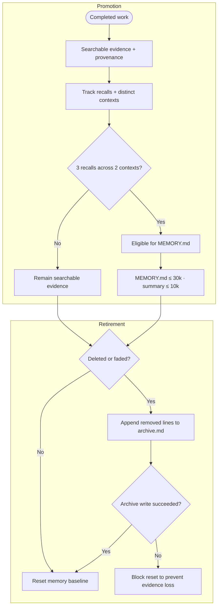
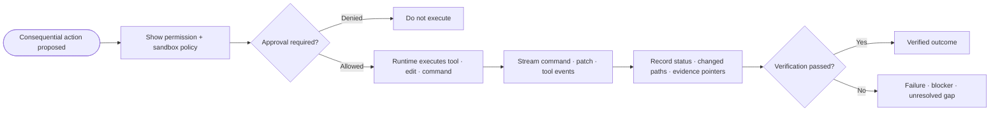

# Elpis

[](https://github.com/MasihMoafi/Elpis/actions/workflows/embedded-elpis-linux.yml)
[](LICENSE)

**The technical substrate is a provider-agnostic shell — goals, context, memory, permissions, evidence — that survives underneath whichever model or runtime you plug into it. The "become Elpis" framing is the narrative layer on top of that: instead of the user adapting to each tool's quirks, the tool adapts to the user and stays legible no matter which model sits inside it.**

Elpis exists because long agent sessions lose shape. Goals get buried in transcripts,
decisions disappear after compaction, and a new session often begins with the user explaining
the same task again.

Elpis keeps the active goal, admitted context, decisions, verification, and next action
explicit. Exact evidence stays on disk. Model-visible context stays small.

It contains the Codex Rust execution foundation for terminal interaction, patches,
permissions, sandboxing, and ChatGPT authentication. Elpis owns its retrieval, portable
context, local memory, provider support, behavior, and interface.

> **Current state:** under active development. `v0.1.0` will be tagged after the release
> checks in [TASKS.md](TASKS.md) pass.

## What works

- Native Ratatui terminal interface with streaming commands, patches, permission modes,
  sandboxing, mouse selection, sessions, and compaction.
- ChatGPT subscription authentication inherited from Codex.
- OpenRouter support through `OPENROUTER_API_KEY`, separate from ChatGPT login.
- Claude Sonnet and Gemini Pro/Flash launcher shortcuts through OpenRouter.
- Native Anthropic Messages and Google Gemini adapters (`--provider anthropic`,
  `--provider google-gemini`) with streaming and mock-server tests; live vendor
  acceptance pending.
- One internal, read-only RAG service with `/rag` and autonomous retrieval.
- Portable workspace state through compact `GOAL.md` and `ES.md` files.
- Exact thread resume or lean continuation in a fresh thread.
- `/status` reporting for admitted context: source, size, lifetime, and reason.
- Local bounded memory with age-aware retrieval, diversity, recall tracking, promotion after
  repeated use across distinct contexts, and an archive for deleted or faded facts.

The context and memory foundations compile and pass focused remote checks, but their
user-visible end-to-end acceptance is still pending. The `claude` and `gemini` launcher
shortcuts use OpenRouter compatibility routes, while native Anthropic and Google adapters
exist as the separate `anthropic` and `google-gemini` providers; live vendor acceptance is
still pending. The distinctive
cyan continuity interface (identity header and Context Ledger) is partially implemented;
the `Choose a mind` model picker, signature continuity event, and evidence-first
completion hierarchy remain. [TASKS.md](TASKS.md)
is the current-state record.

## The working model

Elpis keeps the surrounding control environment stable while the selected runtime performs the model loop. Exact evidence remains durable; only a small, reasoned working set enters the next request.

### Operating model

Elpis owns context, memory, continuity, permissions, and evidence around an explicitly selected runtime. The runtime may change without silently discarding Elpis-owned state.



### Context management

Elpis admits rules, the current request, portable state, and relevant memory into a small working set. `/status` exposes why each source is present while full artifacts stay on disk.

The working context is not the transcript. Full conversations, terminal events, and artifacts
remain available as evidence, but are retrieved only when a later task needs them. Retrieval may
use an exact evidence pointer first and RAG only when the relevant artifact is not already known;
neither makes the full history a default prompt attachment. The aim is to make a modest context
window useful and legible, rather than pay to resend an ever-growing one.



### Session continuity

Elpis resumes the useful native thread exactly or starts a lean thread from `GOAL.md` and `ES.md`. Pre-compaction synchronization fails closed instead of risking a broken handoff.



### Memory management

New evidence stays searchable until repeated useful recall makes it eligible for durable memory. Durable artifacts are bounded, and deleted or faded lines are archived before reset.



### Read-only RAG

The startup path exposes one minimal read-only tool without loading the retrieval stack. Embeddings and indexing load lazily only after an explicit semantic query.


### Safe execution and evidence

Consequential actions pass through visible permission and sandbox policy before execution. Elpis records outcomes and evidence, then distinguishes verified success from failure or unresolved gaps.



## Install

Tagged releases publish a Linux x86_64 binary and checksum. From a checkout:

```bash
scripts/install-elpis.sh
```

The installer verifies the checksum and installs `elpis` into `~/.local/bin` atomically.

OpenAI subscription login is the default. OpenRouter is separate:

```bash
export OPENROUTER_API_KEY="your-key"
elpis --provider openrouter --model "provider/model"
```

Compatibility shortcuts:

```bash
elpis --provider claude
elpis --provider gemini
elpis --provider gemini-flash
```

These shortcuts use OpenRouter. The native vendor adapters are separate providers:

```bash
export ANTHROPIC_API_KEY="your-key"
elpis --provider anthropic

export GEMINI_API_KEY="your-key"
elpis --provider google-gemini
```

## Verification

Linux verification and binary builds run through
[`.github/workflows/embedded-elpis-linux.yml`](.github/workflows/embedded-elpis-linux.yml).
Ordinary changes run focused first-release checks and build the Elpis binary. Exhaustive
inherited TUI/app-server regression runs nightly, manually, and for tagged releases.

The Python retrieval service has focused tests under `tests/`. Release acceptance is tracked
in [TASKS.md](TASKS.md). The measured build and dependency-reduction plan is documented in
[`docs/BUILD_AND_REDUCTION_AUDIT.md`](docs/BUILD_AND_REDUCTION_AUDIT.md). A green workflow
badge means that workflow passed. It does not mean unfinished work is finished.

## Principles

- Say what is implemented and what is not.
- Keep exact evidence on disk and admitted context small.
- Preserve the active goal, decisions, constraints, verification, and next action.
- Treat memory as selected reusable knowledge, not stored conversation.
- Keep authentication, provider, context, and memory boundaries visible.
- Prefer small changes with focused checks.

## Repository map

- `codex-rs/` — Rust application and TUI.
- `src/` — the single-tool Python retrieval service.
- `AGENTS.md` — agent entry point: dispatch, worktree workflow, and definition of done.
- `GUIDE.md` — product vision, requirements, and architecture source of truth.
- `TASKS.md` — release work, acceptance state, and backlog.
- `docs/CONTEXT_AND_SESSIONS.md` — context and continuation contract.
- `docs/BUILD_AND_REDUCTION_AUDIT.md` — build baseline and measured subtraction plan.

## Development

Rust verification and Linux binary builds run in GitHub Actions. Local Rust compilation is
intentionally avoided on the maintainer's workstation. The Python service uses the project
virtual environment and focused tests under `tests/`.

Elpis is not yet presented as a stable public release.

## License

Elpis is MIT licensed. The contained Codex-derived source retains its upstream Apache-2.0
notices and attribution.
