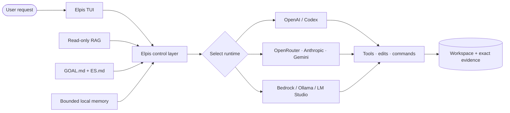
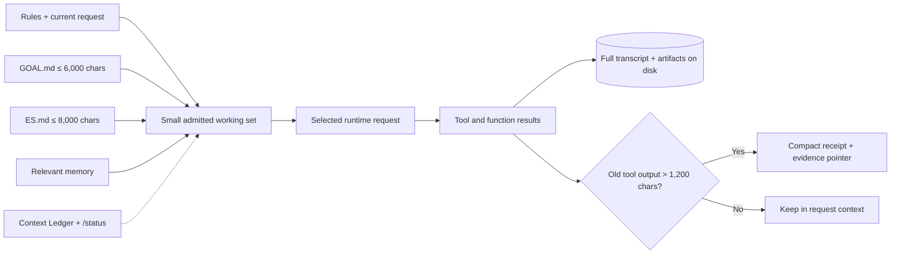
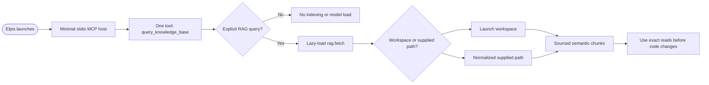

# Elpis

[](https://github.com/MasihMoafi/Elpis/actions/workflows/embedded-elpis-linux.yml)
[](LICENSE)

**Your terminal agent forgets everything. Elpis doesn't.**

Every coding agent today has the same disease: the longer you work, the worse it gets.
Goals drown in transcripts. Decisions vanish at compaction. Every new session starts with
you explaining your task *again*, and every model request resends an ever-fatter history
you're paying for.

Elpis is a terminal agent shell that treats context as a managed asset, not an
ever-growing log:

- **Post-turn context pruning.** After a turn delivers its answer, raw exploration —
  command dumps, file reads, failed probes — is replaced in the *next* request by compact
  receipts with exact evidence pointers. The full transcript stays on disk, retrievable on
  demand; it just stops being resent by default. No other open agent does this per-turn.
- **The Context Ledger.** A visible, scrollable panel showing *exactly* what enters your
  next model request — every rule file, goal, checkpoint, and added file as its own row,
  each one toggleable. You decide what the model sees. `/add` a file of your own.
- **Portable continuity.** The active goal (`GOAL.md`) and a lean checkpoint (`ES.md`)
  survive compaction, session death, and even switching runtimes. Resume a thread exactly,
  or start a fresh one that already knows your goal, last result, and next action —
  without replaying history.
- **Earned memory.** Facts become durable memory only after repeated useful recall across
  distinct contexts. Everything else stays as searchable evidence. Deleted memories are
  archived before reset — never silently lost.
- **Runtime-agnostic.** The shell survives underneath whichever model performs the loop:
  ChatGPT/Codex subscription login, OpenRouter, native Anthropic and Gemini adapters,
  Bedrock, Ollama, LM Studio. Put a model into Elpis and it becomes Elpis: your goals,
  context, memory, and rules.

The execution foundation (terminal UI, patches, permissions, sandboxing, sessions) is a
subtracted fork of OpenAI's Apache-2.0 Codex CLI, hardened by upstream, owned here.

> **Current state:** approaching first release. `v0.1.0` is tagged only after live
> acceptance recorded in [TASKS.md](TASKS.md). A green badge means those checks passed —
> it never means unfinished work is finished.

## What works today

- Native Ratatui terminal interface with streaming commands, patches, permission modes,
  sandboxing, mouse selection, sessions, and compaction.
- ChatGPT subscription authentication; OpenRouter through `OPENROUTER_API_KEY`; native
  Anthropic Messages and Google Gemini adapters (`--provider anthropic`,
  `--provider google-gemini`; live vendor acceptance pending).
- One internal, read-only RAG service: `/rag <query>`, `/rag <path> -- <query>`, and
  autonomous retrieval.
- Portable `GOAL.md` + `ES.md` continuity; exact resume or lean continuation.
- The Context Ledger with per-file rows and toggles; `/status` reporting every admitted
  source with size, lifetime, and reason.
- Bounded local memory with recall tracking, promotion, provenance, and a
  fail-closed archive.
- Deterministic first-pass context cleaning: older long tool outputs become bounded
  excerpts with durable `rollout://` evidence pointers.

The full pruning engine — the agent-authored turn outcome record described in
[`docs/CONTEXT_AND_SESSIONS.md`](docs/CONTEXT_AND_SESSIONS.md) — is the flagship feature
in active development, alongside a visible per-turn "context saved" metric.

## The working model

Elpis keeps the surrounding control environment stable while the selected runtime performs the model loop. Exact evidence remains durable; only a small, reasoned working set enters the next request.



### Context management

Elpis admits rules, the current request, portable state, and relevant memory into a small working set. The Context Ledger and `/status` expose why each source is present while full artifacts stay on disk.

The working context is not the transcript. Full conversations, terminal events, and artifacts
remain available as evidence, but are retrieved only when a later task needs them — by exact
evidence pointer first, RAG second. Neither makes the full history a default prompt
attachment. The aim is to make a modest context window sufficient and legible, rather than
pay to resend an ever-growing one.



### Session continuity

Elpis resumes the useful native thread exactly or starts a lean thread from `GOAL.md` and `ES.md`. Pre-compaction synchronization fails closed instead of risking a broken handoff.


### Memory management

New evidence stays searchable until repeated useful recall makes it eligible for durable memory. Durable artifacts are bounded, and deleted or faded lines are archived before reset.


### Read-only RAG

The startup path exposes one minimal read-only tool without loading the retrieval stack. Embeddings and indexing load lazily only after an explicit semantic query.



### Safe execution and evidence

Consequential actions pass through visible permission and sandbox policy before execution. Elpis records outcomes and evidence, then distinguishes verified success from failure or unresolved gaps.


## Install

Linux x86_64 today; macOS and Windows builds are planned through CI release runners.
Tagged releases publish a checksummed binary. From a checkout:

```bash
scripts/install-elpis.sh
```

The installer verifies the checksum and installs `elpis` into `~/.local/bin` atomically.

The internal RAG service (`/rag`) is a separate Python sidecar, off by default. To enable
it:

```bash
scripts/setup-rag.sh
```

This creates the venv and writes the `mcp_servers.elpis-rag` entry in `config.toml` with
absolute paths computed from wherever the repo actually lives on this machine — never
hand-edit those paths, and re-run this script after moving the repo or on a fresh device.

OpenAI subscription login is the default. Other routes:

```bash
# OpenRouter (separate key)
export OPENROUTER_API_KEY="your-key"
elpis --provider openrouter --model "provider/model"

# Native vendor adapters
export ANTHROPIC_API_KEY="your-key"
elpis --provider anthropic

export GEMINI_API_KEY="your-key"
elpis --provider google-gemini
```

`elpis --provider claude|gemini|gemini-flash` are OpenRouter compatibility shortcuts,
distinct from the native adapters above.

## Verification

Linux verification and binary builds run through
[`.github/workflows/embedded-elpis-linux.yml`](.github/workflows/embedded-elpis-linux.yml).
Ordinary changes run focused first-release checks and build the Elpis binary. Exhaustive
inherited TUI/app-server regression runs nightly, manually, and for tagged releases.

The Python retrieval service has focused tests under `tests/`. Release acceptance is tracked
in [TASKS.md](TASKS.md). The measured build and dependency-reduction plan is documented in
[`docs/BUILD_AND_REDUCTION_AUDIT.md`](docs/BUILD_AND_REDUCTION_AUDIT.md).

## Principles

- Say what is implemented and what is not.
- Keep exact evidence on disk and admitted context small.
- Preserve the active goal, decisions, constraints, verification, and next action.
- Treat memory as selected reusable knowledge, not stored conversation.
- Keep authentication, provider, context, and memory boundaries visible.
- Prefer small changes with focused checks.

## Repository map

- `codex-rs/` — Rust application and TUI.
- `src/` — the single-tool Python retrieval service.
- `AGENTS.md` — agent entry point: dispatch, workflow, and definition of done.
- `GUIDE.md` — product vision, requirements, and architecture source of truth.
- `TASKS.md` — release work, acceptance state, and version-mapped backlog.
- `docs/CONTEXT_AND_SESSIONS.md` — context and continuation contract.
- `docs/BUILD_AND_REDUCTION_AUDIT.md` — build baseline and measured subtraction plan.

## License

Elpis is MIT licensed. The contained Codex-derived source retains its upstream Apache-2.0
notices and attribution.
