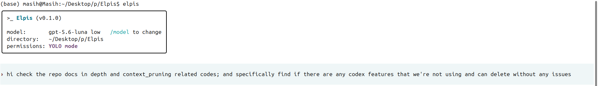
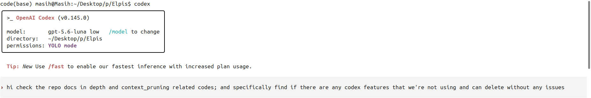
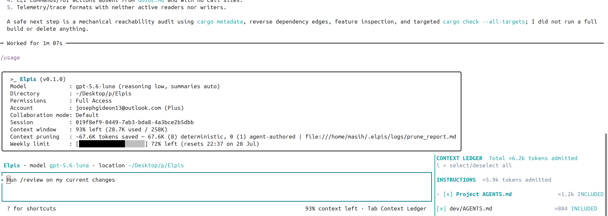
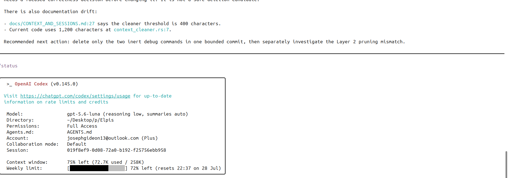

# Elpis

[](https://github.com/MasihMoafi/Elpis/actions/workflows/embedded-elpis-linux.yml)
[](LICENSE)

**A coding agent should not need the full transcript to remember why it is changing your code.**

Elpis is a terminal coding-agent shell that keeps goals, selected context, memory, and evidence separate from the raw conversation log. It is for developers running long or repeated coding sessions who want to inspect what enters the next model request instead of treating the transcript as the product state.

**Current release:** `v0.1.0` on Linux x86_64. Release acceptance and the live development state are tracked in [TASKS.md](TASKS.md).

## Quick start

Install the latest Linux x86_64 release and start Elpis:

```bash
mkdir -p "$HOME/.local/bin" && curl -fsSL https://github.com/MasihMoafi/Elpis/releases/latest/download/elpis-linux-x86_64 | install -m 755 /dev/stdin "$HOME/.local/bin/elpis"
elpis
```

Expected result:

```text
$ elpis
Welcome to Elpis
›
```

This assumes `~/.local/bin` is on your `PATH`. On first launch, choose a provider and complete its sign-in or API-key setup.

Deeper guides are hosted on GitHub Pages:

- [Context and sessions](https://masihmoafi.github.io/Elpis/context-and-sessions/)
- [Memory](https://masihmoafi.github.io/Elpis/memory/)
- [Provider configuration](https://masihmoafi.github.io/Elpis/providers/)

## Proof: one controlled context-pruning comparison

The screenshots below show Elpis and Codex running the same task. In this recorded comparison, Elpis ended with **93% free context** and Codex with **73% free context**.

This is a reproducible demonstration of one workflow, not a claim that Elpis will produce the same reduction on every task.

### Initial prompt submission




### Execution outcome

**Elpis: 93% free context remaining**



**Codex: 73% free context remaining**



## The problem

Long coding-agent sessions accumulate transcripts and tool output. Important goals and decisions can become difficult to distinguish from disposable execution detail, while replaying large histories consumes context that could be used for the current task.

Elpis addresses that specific workflow problem by keeping exact evidence on disk while admitting a smaller, inspectable working set into the next request.

## How it works

Elpis uses three context-reduction layers:

| Level | Component | Trigger | Operation | Inspection |
| --- | --- | --- | --- | --- |
| 1 | Deterministic tool cleaner | Tool output over 1,200 characters | Replaces oversized stdout/stderr with positional head/tail receipts | `/status` and `rollout://tool-call/<id>` evidence pointers |
| 2 | Ace model pruner | End of eligible turns | Evaluates conversation turns and removes transient material while retaining selected decisions | `/prune` and the local pruning report |
| 3 | Session compaction | `/compact` or context-budget pressure | Compacts older history while preserving portable goal/checkpoint state | Context Ledger, `/usage`, and local rollout logs |

The execution foundation—terminal UI, patches, permissions, sandboxing, and sessions—is derived from OpenAI's Apache-2.0 Codex CLI. Elpis adds its own context, continuity, memory, retrieval, and provider-control layer around that execution loop.

## Working model

Elpis keeps the surrounding control environment stable while the selected runtime performs the model loop. Exact artifacts stay available as evidence; the next request receives only the admitted working set.


### Context and session continuity

Rules, the current request, portable state, added files, and selected memory are represented separately. The Context Ledger and `/usage` expose why a source is present and how much space it occupies.


Full conversations, terminal events, and artifacts remain on disk. Elpis can retrieve exact evidence later instead of attaching the full history to every request.

### Memory

Reusable facts are promoted into bounded durable memory only after repeated useful recall. Deleted or faded memory is archived before reset.

### Read-only RAG

The optional local RAG sidecar exposes one read-only retrieval tool. Embeddings and indexing load only when semantic retrieval is requested.

### Execution and evidence

Consequential actions pass through visible permission and sandbox controls. Outcomes and supporting evidence remain inspectable after execution.

## Current state

Source of truth: [TASKS.md](TASKS.md).

### Implemented and verified

- `v0.1.0` Linux x86_64 release path and checksummed installer.
- Ratatui terminal interface with streaming commands, patches, permission modes, sandboxing, sessions, and compaction.
- Dual-layer pruning: deterministic tool receipts plus Ace message pruning.
- Context Ledger and `/usage` source accounting.
- Portable `GOAL.md` + `ES.md` continuity and exact session resume.
- Bounded local memory with provenance, recall tracking, promotion, and archival.
- Local read-only RAG.
- OpenAI subscription authentication plus supported Anthropic, Gemini, and OpenRouter adapters.
- Context Ledger interaction accepted by the project owner on 2026-07-23.

### Implemented, still under ongoing acceptance/polish

- The current baseline remains under bug-fix and UI-polish work. Existing context, continuity, pruning, memory, RAG, provider, permission, and session behavior are treated as foundational regressions if they break.

### Planned or deferred

- Easier installation and distribution.
- Apple Silicon macOS build targeted for `v0.2`; Windows comes later.
- Structured interactive clarification.
- Multi-agent controls and `/multi-task`.
- Voice input.
- LSP-backed code intelligence.
- `/auto` cost-saving model routing remains a deferred experiment until it proves that routing actually reduces total cost without unacceptable mistakes.

### Not supported in `v0.1.0`

- macOS and Windows release binaries.
- `/auto`, `/multi-task`, voice input, and LSP integration.

## What sets the design apart

These are design choices, not novelty claims:

- **Context is inspectable.** The Context Ledger shows admitted sources instead of treating the full transcript as an opaque prompt.
- **Evidence and working context are different things.** Exact artifacts stay durable even when they are not resent to the model.
- **Continuity is explicit.** Goal and checkpoint state can survive compaction or a fresh session without replaying the entire conversation.
- **Memory is selective.** Reusable memory is bounded and promoted from evidence rather than equated with stored chat history.
- **Provider identity stays visible.** The control layer does not silently collapse provider selection into one opaque route.

## Evals and test series

Linux verification and binary builds run through [`.github/workflows/embedded-elpis-linux.yml`](.github/workflows/embedded-elpis-linux.yml).

Ordinary changes run focused first-release checks and build the Elpis binary. Broader inherited TUI/app-server regression runs are reserved for nightly, manual, and tagged-release workflows.

The Python retrieval service has focused tests under `tests/`. Release acceptance is tracked in [TASKS.md](TASKS.md). Build and dependency-reduction measurements live in [`docs/BUILD_AND_REDUCTION_AUDIT.md`](docs/BUILD_AND_REDUCTION_AUDIT.md).

A passing CI badge proves that the configured automated checks passed for the referenced commit. It does not prove that every provider, workflow, or long-running session shape has been exercised.

## Install from a checkout

Tagged releases publish a checksummed binary. From a checkout:

```bash
scripts/install-elpis.sh
```

The installer verifies the checksum and installs `elpis` into `~/.local/bin` atomically.

To enable the optional local RAG sidecar:

```bash
scripts/setup-rag.sh
```

The setup script creates the environment and writes the `mcp_servers.elpis-rag` entry in `config.toml` using paths derived from the current checkout.

Provider examples:

```bash
# OpenRouter
export OPENROUTER_API_KEY="your-key"
elpis --provider openrouter --model "provider/model"

# Native Anthropic adapter
export ANTHROPIC_API_KEY="your-key"
elpis --provider anthropic

# Native Gemini adapter
export GEMINI_API_KEY="your-key"
elpis --provider google-gemini
```

## External docs

Keep the README high-level; use the documentation site for deeper contracts and configuration:

- [Context and sessions](https://masihmoafi.github.io/Elpis/context-and-sessions/)
- [Memory](https://masihmoafi.github.io/Elpis/memory/)
- [Providers](https://masihmoafi.github.io/Elpis/providers/)
- [`GUIDE.md`](GUIDE.md) — product vision, requirements, and architecture source of truth
- [`TASKS.md`](TASKS.md) — current release state and backlog
- [`docs/BUILD_AND_REDUCTION_AUDIT.md`](docs/BUILD_AND_REDUCTION_AUDIT.md) — measured build/subtraction work

## Future development

Only work already represented in [TASKS.md](TASKS.md) belongs here. The near-term direction is baseline polish and distribution before new feature expansion.

## Repository map

- `codex-rs/` — Rust application and TUI.
- `src/` — local retrieval service.
- `AGENTS.md` — agent workflow and definition of done.
- `GUIDE.md` — product vision, requirements, and architecture source of truth.
- `TASKS.md` — live task and acceptance source of truth.
- `docs/CONTEXT_AND_SESSIONS.md` — context and continuation contract.
- `docs/BUILD_AND_REDUCTION_AUDIT.md` — build baseline and measured subtraction plan.

## License

Elpis is MIT licensed. Codex-derived source retains its upstream Apache-2.0 notices and attribution.
